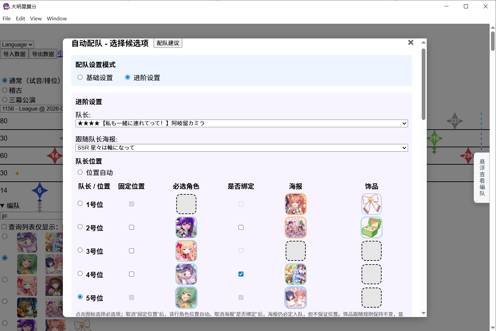
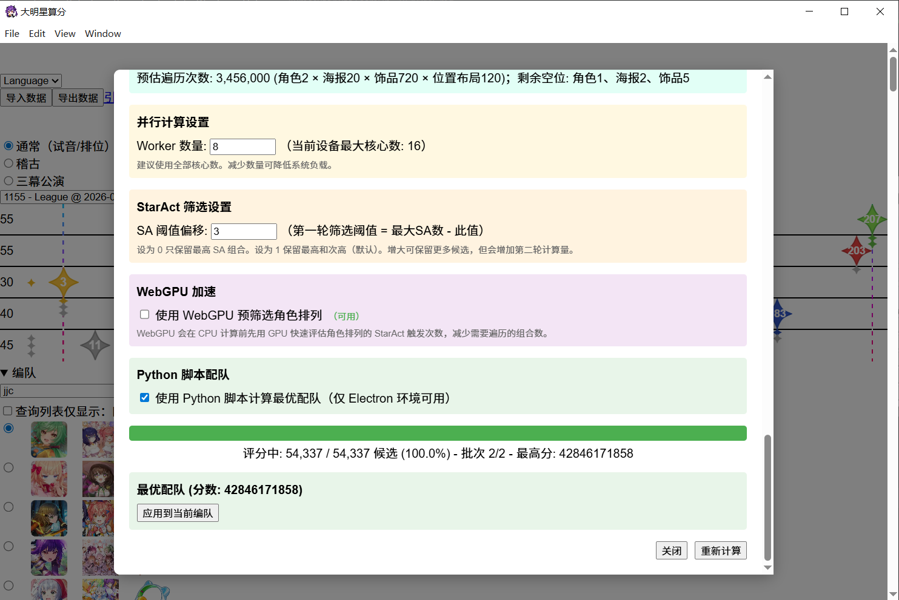

# YumesuteAutoTeamUp
Auto team-up script for Yumesute

ymst自动配队器☆现已加入 [@演员](https://github.com/yanyuanSagiri) 的豪华扩展计算器~

由于本项目仅为 plug-and-play 的优质配队生成器, 并非完整的计算器实现; 因此不在该项目内提供 Release 作为解决方案.

若需要使用计算器, 你可以前往[扩展计算器](https://github.com/yanyuanSagiri/ymst_est_calc_expand)项目, 或者进入观星部聊天群直接获取最新版打包计算器.





## 功能

- **队伍状态生成**: 根据用户游戏数据及编队条件, 输出可能的队伍最高分组合.
- **筛选并保存 k 优解的集合**: 根据初次队伍分数的计算结果, 按分数维护一定数量的不同角色/海报状态的队伍, 送入包含相册/非功能性饰品优化的完整计算获取最终结果.


## 项目特点

- **角色过滤**: 对用户未持有角色进行过滤, 角色状态生成前对重复角色进行去重处理.
- **海报过滤**: 对用户未持有海报进行过滤, 根据用户所持有的每个角色的约束条件, 以及海报之间的限制/无效词条过滤, 为每个角色维护一个用户所有海报的可持久化 pareto 最优解集, 通过海报之间的上/下位关系维护一个 DAG 以实现解集版本的切换, 减少约 99.961% 的状态数量; 随着游戏更新只会剪得更多!
- **饰品过滤**: 对用户未持有饰品进行过滤, 并仅处理影响轴的功能性饰品, 减少了巨量的饰品状态.
- **二次状态过滤**: 将初次计算结果存入小根堆, 通过字典映射按分数为相同角色/海报的队伍维护限制数量的高分结果, 防止同一个状态的不同排列与不同饰品占满整个结果堆, 同时防止真正的最优解在初次计算时作为次优解被滤除.


<details>

<summary style="font-size: 1.5em; font-weight: bold;">
开发须知
</summary>

- [1. 账号数据提取](#1-账号数据提取)
- [2. 游戏内数据资源相关](#2-游戏内数据资源相关)
- [3. 使用方法](#3-使用方法)
- [3.0 注意事项](#30-注意事项)
- [3.1 开始使用](#31-开始使用)
- [3.2 配队状态输出格式与请求体相关](#32-配队状态输出格式与请求体相关)
- [3.3 控制信息输入与输出格式](#33-控制信息输入与输出格式)
- [3.4 结果筛选与统计](#34-结果筛选与统计)


## 1. 账号数据提取

首先, 你需要将你游戏账号的数据导出.

唯一推荐的途径是通过 [@esterTion](https://github.com/esterTion) 提供的[引继码导出工具](https://redive.estertion.win/wds/calc/YumesuteExporter.exe), 提取账号的 .json 文件.
当然想自己解包也行, 你需要确保数据文件的格式类似为:

```text
{
  "characters": [[142360,255,1,2,5,5],[150040,260,true,2,5,5],[Id,等级(略),觉醒(略),故事(略),技能(略),开花(略)]],
  "posters": [[230330,6,0],[330380,10,4],[Id,等级,突破次数]],
  "accessories": [[330010,10,0],[320370,1,112],[Id,等级(略),下标(略)]],
}
```

其他内容实际上用不到, 可以直接全塞进来也可以不提供. 引继码导出工具默认提供所有 key, 可以直接拿来用.

## 2. 游戏内数据资源相关

角色/海报/饰品详细信息是存储在这类文件中的, 所以在得到你的账号数据后, 需要在这些文件中找到具体数据, 以进行具体的配队优化.

配队器需要**当前版本**的:

- `CharacterMaster.json`: 用来检索账号所拥有的角色的相关数据.
- `PosterAbilityMaster.json`: 用来检索账号所拥有的海报的相关数据.
- `EffectMaster.json`: 用来检索已有(角色和)海报的词条.
- `accessory_processed.json`: 用来进行饰品筛选. 该文件为本项目特别设计, 请在本仓库中进行下载.

~~当然, 没抽卡就不用~~

目前已将资源更新单独设计为一个模块, 运行 `/scripts/update.sh` 即可. 建议直接使用 git bash 运行.

---

<details>

<summary style="color: #38B0DE"> 自动更新脚本用不了? </summary>

如果因为网络或者其他问题导致自动更新脚本不可用, 你也可以暂时通过以下任一方式进行游戏数据的部署. **注意会下载全部文件**. 但其他文件在其他模块中也可能~~一定~~用到, 顺手的事儿.

- 直接访问及时更新的[Database地址](https://github.com/esterTion/yumesute_master_db_diff)进行下载.
- 等效地, 可以在本地的 git bash 中执行

```bash
git clone https://github.com/esterTion/yumesute_master_db_diff
```

该命令将会在终端的当前路径生成名为 `yumesute_master_db_diff` 的, 包含其内容的文件夹.

- 若未安装 git, 则可复制下面所有命令, 在 Powershell 中点击右键粘贴:

```shell
$baseUrl = "https://redive.estertion.win/wds/calc/master/"
$response = Invoke-WebRequest -Uri $baseUrl

$pattern = 'href="([^"]+\.(json|txt|version))"'
$matches = [regex]::Matches($response.Content, $pattern)

foreach ($match in $matches) {
    $filename = $match.Groups[1].Value
    $fileUrl = $baseUrl + $filename
    $outputPath = Join-Path -Path "." -ChildPath $filename
    
    Write-Host "正在下载: $filename" -ForegroundColor Green
    Invoke-WebRequest -Uri $fileUrl -OutFile $outputPath
}
```

该命令将会在终端的当前路径直接下载每个文件.

</details>

## 3. 使用方法

### 3.0 注意事项

关于配队器的原理:

- 本配队器仅对海报和饰品选择进行了优化, 角色方面还是普通的去重加暴力搜索, 且在计算模块没完成前, 本人并不打算做角色部分的优化.
- 因此角色的状态很多, 请尽量确保多选择绝对用得上的角色, 待选角色数量也必须控制. ~~游戏强度迭代这么快, 很老的用不到的卡一眼看得出来, 请你作为专家系统自己处理预输入.~~
- 海报的状态同理, 但是写了 pareto 前沿进行词条剪枝, 目前能 hack 掉 99.961% 的海报组合. 因此在尽量多选择绝对用得上的海报的前提下, 剩余的空位可以放入你的整个 box, 影响不大.
- 建议至少选 `3` 个及以上必须入队的指定角色卡(不是角色), 以及 `2` 个及以上必须入队的海报. 像vs/星轮和fd这种必选的请不要让配队器考虑.

关于用户输入:

- 关于角色. 参数是先输入 `角色id`, 随后一个参数是可选的角色固定轴(`1, .., 5`), 然后交替.
- 关于海报, 参数是先输入 `海报id`, 随后一个参数是其捆绑的 `角色id`, 然后交替.
- 详细配置见 3.1.

### 3.1 开始使用

首先, 你必须将你自己的游戏账号的数据 `xxx.json` 放到根目录. ~~虽然按理来说应该放data, 但感觉放根目录更方便使用.~~

然后, 可以使用 `/scripts` 中的已提供简易脚本. 你可以:
- 通过运行其中的 `update.sh` 更新游戏内数据文件至最新版本.
- 随后运行其中的 `teamup.sh` 开始配队. (当然你也可以直接使用 `python Start.py < xxx.json` 作为输入)
- 至于 server 模块, 由于无人维护, 因此暂时没有后续处理逻辑, 代码可能也有细节仍需打磨.
- 推荐使用 git bash 终端. 否则你需要自己打开 `teamup.sh` 文件去手动修改 `USER_NAME` 等字段的值. ~~好像这样更方便~~

在终端通过输入指定参数可以实现个性化配队. 

```bash
git bash your_path_to_root/scripts/teamup.sh [账号数据地址] [参数1] [值] [参数2] [值] [...]
```

具体来说, 可以这样:

```bash
# 为方便展示, 使用 \ 作为换行符
<path_to_scripts> bash ./teamup.sh userdata717.json \
-mc 150010 0 150020 0 150030 0 150040 0 0 0 \
-mp 330380 150030 230120 150040 0 0 0 0 0 0 \
-ml 3
```

目前支持输入的参数包括:

| 参数     | 类型        | 默认值                  | 必需  | 说明                                                                                                             |
|--------|-----------|----------------------|-----|----------------------------------------------------------------------------------------------------------------|
| `user` | `str`     | `Yumesute.json`      | 否   | 是你的用户数据 `xxx.json`. 把它放在配队器项目的根目录. <br> 使用时无需输入 `user`, 直接输入 `xxx.json` 即可. <br> **名称中间不允许空格 ~~`x xx.json`~~** |
| `-mc`  | `int[10]` | `[0]*10`             | 否   | 结构类似 `[必选角色1, 其固定位置1, 必选角色2, ...]` <br> 无需求则补 `0`                                                              |
| `-mp`  | `int[10]` | `[0]*10`             | 否   | 结构类似 `[必选海报1, 绑定的角色i, 必选海报2, ...]` <br> 无需求则补 `0`                                                              |
| `-ml`  | `int`     | 0                    | 否   | 固定队长位置. **非 server 不使用**.                                                                                      |
| `-d`   | `string`  | `/path/to/your/data` | 否   | 本地存储游戏内数据资源的路径                                                                                                 |

以分别控制队伍基础状态的暂停与继续.

### 3.2 配队状态输出格式与请求体相关

经由 `Start.py` 的输出根据 [@演员](https://github.com/yanyuanSagiri) 的要求, 在终端提供 json 字符串的输出流.

为提高状态生成效率, 队伍基础状态为长度 `15` 的元组, 输出为 JSON 数组:

```json lines
[150040, 150010, 150020, 150030, 140930, 230120, 230980, 330250, 330380, 230270, 331710, 430220, 331710, 331710, 330170]
[150040, 150010, 150020, 150030, 140930, 230120, 230980, 330060, 330380, 230340, 331710, 331710, 331710, 331710, 331710]
```

`15` 个按顺序五五为角色, 海报和饰品的状态.


经由 `StartForServer.py` 的输出根据 [@Ohnkyta](https://github.com/OhnkytaBlabdey) 的 ymst-calc-server 要求, 提供:

```json
    {
        "data_file": "example.json",
        "team": {
            "characters": [142360, 150040, 150030, 150020, 150010],
            "posters": [340210, 330230, 330290, 230840, 330310],
            "accessories": [430220, 331710, 331710, 331710, 331710],
            "leader": 0
        },
        "sensenotation": 1146,
        "score_only": false
    }
```

至默认的端口 `3456` 上.


### 3.3 控制信息输入与输出格式

配队器会默认提供当前运行的状态: 当前 box 的角色排列数量之和, 以及当前处理到了第几个状态, 方便设置进度条.

具体来说, 你可能会接收到下面两个字段:

```json lines
{"type": "character_total", "num": len(total_characters_status)}
{"type": "character_now", "num": count_for_processed_characters_status}
```

后面的数量均为整型.

至于每个角色状态对应的海报, 和更进一步的饰品处理状态, 由于数量很多, 影响效率, 因此不提供输出.

此外, `Start.py` 允许发送控制信息以暂停队伍基础状态的输出, 防止内存爆炸. 具体来说, 允许在配队器运行时, 随时输入对象:

```json lines
{"Control": "stop"}
{"Control": "continue"}
```

### 3.4 结果筛选与统计

这部分暂时用不到, 不写.

预计会维护一个类似带字典的小根堆, 维护每个角色/海报状态下的最优解, 饰品和队长部分直接去重.